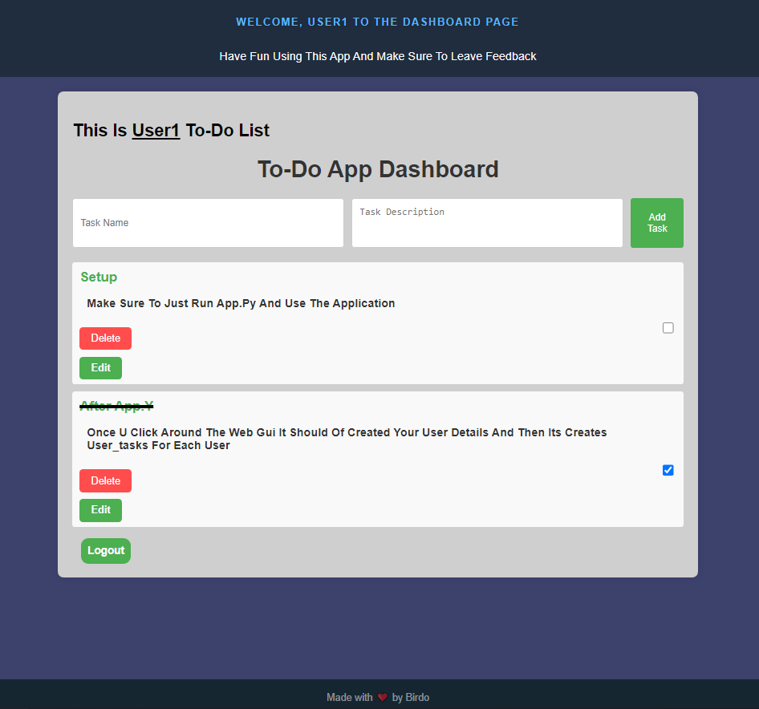
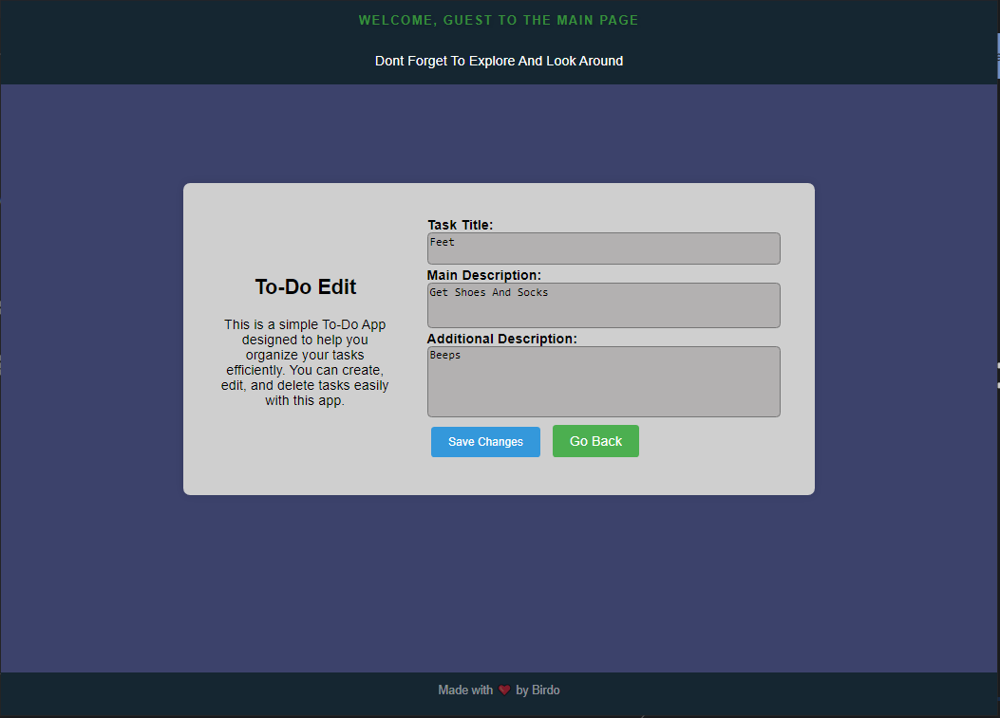

# To-Do List Application




## Introduction

This To-Do List Application is a web-based task management system developed using the popular Flask web framework in Python. The application allows users to register, log in, create tasks, edit tasks, mark tasks as completed, and delete tasks. It is aimed at helping users build their skills with Python, HTML, and CSS, utilizing a non-native Python framework to build and run the application.

The application was built for general usage and to help organize daily tasks effectively for both myself and other users.

## Usage
To use the To-Do List Application:
1. Install dependencies:
    ```bash
    pip install Flask
    pip install flask-bcrypt
    ```
    Or  
    ```bash
    pip install -r requirements.txt
    ```

2. Clone the repository:
    ```bash
    git clone https://github.com/Birdo1221/Users-Todo-WebApp.git
    cd Users-Todo-WebApp
    ```

3. App secret_key:
   ```
   Make sure to change this value 'app.secret_key' as it currently being used to sign
   session cookies and handle session management.
   This is only because we are using the Flask framework.
   ```
## File Structure

The application comprises several files and directories, each serving a specific purpose:

- *Flask File Structure:*
- **app.py:** This is the main Flask application file where the routes and functionality of the web application are defined.
- **templates directory:** Contains HTML templates for rendering pages to users.
- **static directory:** Stores static files such as CSS, JavaScript, and images used by the application.


- *Created Directories / Files:*
- **user_tasks directory:** Holds JSON files that store task data for each user.
- Each user has a unique task file associated with their account name based on a Base64 encoding of their username.

  
- For example: [task_(UsernameBase64).json]
- [YWRtaW4=] represents Admin, so the file will be named: [tasks_YWRtaW4=.json]


- For each user, every task is generated using a UUID to name the tasks and save/store them in the user's independent JSON file, which contains:
  
-     
     ```
     [
     UUID Generated Id
     Task Name
     The Task Description
     If marked as completed or not
     ]
     ```
     Example:
     ```
     [
     {
       "id": "ac9e4bb7-0a75-47d3-b5a5-6c7a184dbb27",
       "name": "update to-do ",
       "description": "Make to update to-do app for profile pfp's and clean-up code ",
       "completed": false
     },
     {
       "id": "d1f51f41-c7dd-4206-8575-6408a0c1695e",
       "name": "hands",
       "description": "get some gloves",
       "completed": true,
       "additional_description": "I need to go buy some gloves for the winter time"
     }
     ]
     ```
-

## Functionalities

### 1. Registration and Login

- Users can register for an account by providing a unique username, password, security question, and answer.
- Passwords are securely hashed using the `bcrypt` library to ensure data security.
- Upon successful registration, users can log in using their correct credentials.

### 2. Dashboard

- Authenticated users are directed to the dashboard upon login.
- The dashboard displays a web GUI for the creation of users' tasks as well as allowing them to view, edit, delete, and mark tasks as completed.
- Tasks are stored in JSON files associated with each user to maintain privacy and data simplicity.

### 3. Task Management

- Users can create new tasks by providing a task name and description.
- Tasks can be edited to update their details, such as a description and additional notes.
- Completed tasks can be marked as such to track progress and productivity.
- Users have the option to delete tasks they no longer need, helping them maintain a clutter-free task list.

### 4. Security Features

- Passwords are hashed using the bcrypt algorithm to ensure confidentiality and integrity.
- Security questions and answers provide an additional layer of authentication, enhancing account security.

## Feedback and Improvement

### Positive Feedback

- Users appreciate the simplicity and intuitiveness of the application's user interface.
- The ability to manage tasks efficiently helps users stay organized and productive.
- Security measures such as password hashing and security questions instill confidence in the application's security.

### Areas for Improvement

- Enhance user experience with interactive features such as drag-and-drop task reordering.
- Implement notifications and reminders to alert users of approaching deadlines or overdue tasks.
- Introduce collaboration features to enable users to share tasks and collaborate on projects with team members.
- Add more user control and user profiling such as user pfp's and additional settings.


## Conclusion

The To-Do List Application serves as a tool for users who seek to manage their tasks effectively. With a minimalist, user-friendly interface and basic functionality, with an essential part of security, this application aims to help improve task management and productivity efficiently.

